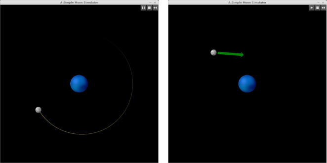

# A Simple Moon Simulator

## Introduction

A simple simulator of the orbital motion of a moon about a fixed planet that I wrote for fun to start learning Pyglet.

## Simulation details

### Scaling

The relative mass of the moon to the planet is approximately the same as that of the Moon to the Earth. One pixel corresponds to 1500 km, and one second of continuous simulation time corresponds to 10 h of real time. The radii of the moon and planet sprites, however, are not to scale (otherwise they would be too small).

### Physical modeling

The trajectory of the moon follows the reciprocal square law of gravitation using an appropriately scaled gravitational constant. The planet is fixed such that the two-body system does not orbit about its center of mass, but rather the moon orbits around the center of the planet. However, since the actual center of mass would be at about 3 pixels from the center of the planet, this is not a huge deviation in accuracy (this is a *simple* moon simulator). The trajectory of the moon is computed using the fourth-order Runge-Kutta algorithm. You can monitor the quality of the simulation over time by watching for changes in the total energy, which should remain constant. Using the `-d, --display` option at startup, you can view all physical parameters as the trajectory is updated.



## Usage

### Installation

Clone the repository to a convenient location. Open a terminal in the repository directory containing the `moonsim` subdirectory and start the program with `python moonsim [options]`. The program depends on only Pyglet and the Python standard library.

### Running the simulation

The program is started using `python moonsim [options]` at the terminal. The simulation defaults to the position and velocity of perigee (for the Moon-Earth system); however, you can start at apogee using the `-a, --apogee` option at startup. Use the `-d, --display` option to see the physical parameters. When the simulation is paused or stopped, you can move the moon with the mouse and change its velocity using the green velocity arrow. To run the simulation, click the play button. The stop button ends the simulation and returns the moon to its startup position and velocity. The pause button stops the simulation and retains the current velocity and position. The reset button returns the moon to the last position and velocity set by the user. If the moon collides with the planet, it explodes (use the stop or reset buttons to get it back).

Currently the simulation window is not resizable and defaults to 800 &#x00d7; 800 px. However, you can set the window dimensions at startup. For example,
```
python moonsim 1000 900
```
will produce a 1000 &#x00d7; 900 px simulation window. Use the `-h, --help` option for more information and options.

### Removal

To remove the program, just delete the repository directory.

## License

This simple moon simulator is licensed under a [BSD 3-Clause License](http://opensource.org/licenses/BSD-3-Clause) (see the `LICENSE.txt` file or use the `-l, --license` option).
